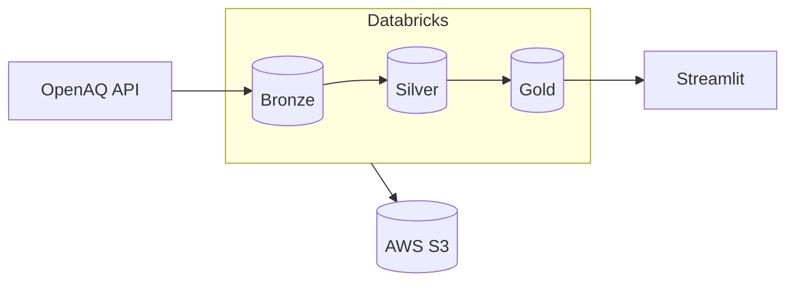
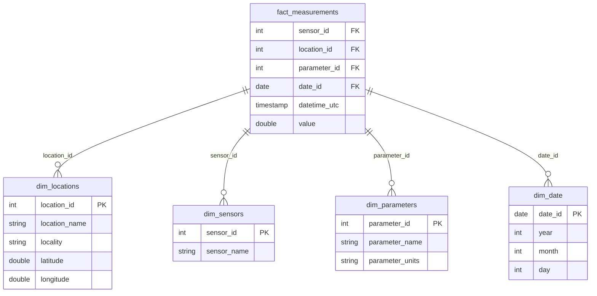

# Canada Air Quality Pipeline

Real-time air quality monitoring pipeline using Databricks, Delta Lake, and AWS S3.

[](https://databricks.com)
[](https://aws.amazon.com)
[](https://streamlit.io)

## Live Demo

🔗 **[Dashboard](https://databricks-airquality.streamlit.app/)** — Interactive map showing air quality across Canada

## Overview

End-to-end ELT pipeline that ingests air quality data from 480+ Canadian monitoring stations, transforms it through a medallion architecture (Bronze → Silver → Gold), and serves it via an interactive dashboard.

**Key Features:**
- Hourly data ingestion from OpenAQ API
- Star schema for analytics (fact + dimensions)
- Incremental loads with MERGE (no duplicates, full history)
- Interactive Streamlit dashboard with animated time series

## Architecture


## Data Model


## Tech Stack

| Layer | Technology |
|-------|------------|
| Ingestion | Python, OpenAQ API v3 |
| Storage | AWS S3, Delta Lake |
| Processing | Databricks, Spark SQL |
| Orchestration | Databricks Workflows |
| Governance | Unity Catalog |
| Visualization | Streamlit, Plotly |

## Project Structure
```
├── notebooks/
│   ├── 00_utils.ipynb                    # Configuration
│   ├── 01_bronze_locations_ingestion.ipynb
│   ├── 02_bronze_measurements_ingestion.ipynb
│   ├── 03_silver_transformations.ipynb
│   └── 04_gold_star_schema.ipynb
├── dashboard/
│   ├── app.py
│   └── requirements.txt
└── sql/
    └── catalog_schema_creation.sql
```

## Local Development
```bash
# Clone repository
git clone https://github.com/aegnor8/databricks-airquality-canada.git
cd databricks-airquality-canada

# Setup dashboard
cd dashboard
python -m venv venv
venv\Scripts\activate  # Windows
pip install -r requirements.txt

# Configure secrets
mkdir .streamlit
echo 'DATABRICKS_HOST = "your-host"' > .streamlit/secrets.toml
echo 'DATABRICKS_HTTP_PATH = "your-path"' >> .streamlit/secrets.toml
echo 'DATABRICKS_TOKEN = "your-token"' >> .streamlit/secrets.toml

# Run
streamlit run app.py
```

## Pipeline Schedule

| Job | Schedule | Description |
|-----|----------|-------------|
| Locations | Daily 00:00 | Station metadata |
| Measurements | Hourly | Air quality readings → Silver → Gold |

## Author

**Mattia Carganico** — [LinkedIn](https://www.linkedin.com/in/mattia-ca/) | [GitHub](https://github.com/aegnor8)