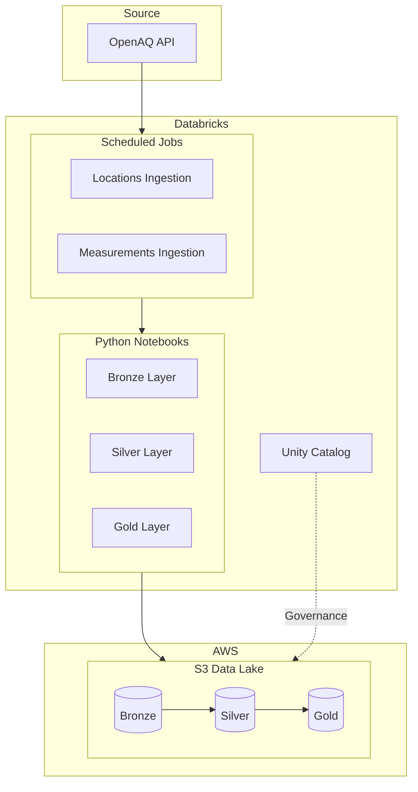

# Air Quality Data Pipeline - Canada

Real-time air quality monitoring pipeline for Canada using OpenAQ API, Databricks Unity Catalog, and AWS S3.

## Architecture


## Data Architecture - Medallion

| Layer | Table | Description | Update Frequency |
|-------|-------|-------------|------------------|
| Bronze | `locations` | Raw monitoring stations from OpenAQ API | Daily |
| Bronze | `measurements` | Raw air quality measurements (latest values) | Every 6 hours (planned: hourly) |
| Silver | TBD | Cleaned and validated data | - |
| Gold | TBD | Aggregated metrics for analytics | - |

## Infrastructure

### AWS Resources

**Region**: `us-east-1` (N. Virginia)

| Resource | Name | Purpose |
|----------|------|---------|
| S3 Bucket | `mattia-airquality-datalake-use1` | Data lake storage (Delta Lake) |
| IAM Role | `airquality-databricks-unity-catalog-role` | Cross-account access for Databricks |

### Databricks Unity Catalog

| Object | Name | Purpose |
|--------|------|---------|
| Catalog | `airquality` | Main container for air quality data |
| Schema | `bronze` | Raw data layer |
| Schema | `silver` | Cleaned data layer |
| Schema | `gold` | Aggregated data layer |
| Storage Credential | `airquality-s3-credential` | IAM Role authentication to S3 |
| External Location | `airquality-external-location` | Maps S3 bucket to Unity Catalog |

## Project Structure
```
airquality-pipeline-canada/
├── README.md
├── notebooks/
│   ├── 00_utils.ipynb              # Shared configuration and functions
│   ├── 01_bronze_locations_ingestion.ipynb    # Daily locations ingestion
│   └── 02_bronze_measurements_ingestion.ipynb # Hourly measurements ingestion
└── sql/
    └── catalog_schema_creation.sql  # Unity Catalog setup
```

## Data Source

**OpenAQ API v3** - Open air quality data from government monitoring stations worldwide.

- **Locations endpoint**: `/v3/locations` - Monitoring station metadata
- **Latest endpoint**: `/v3/locations/{id}/latest` - Most recent measurements
- **Coverage**: ~480 active stations in Canada
- **Parameters**: PM2.5, PM10, O3, NO2, SO2, CO, and more

## Scheduled Jobs

| Job | Schedule | Description |
|-----|----------|-------------|
| `bronze_locations_ingestion` | Daily | Fetches Canadian monitoring stations |
| `bronze_measurements_ingestion` | Every 6 hours | Fetches latest air quality readings |

## Tech Stack

- **Cloud**: AWS (S3, IAM)
- **Data Platform**: Databricks (Unity Catalog, Delta Lake)
- **Data Source**: OpenAQ API v3
- **Languages**: Python, SQL

## Status

- [x] AWS S3 bucket provisioned
- [x] IAM Role with cross-account trust configured
- [x] Databricks Unity Catalog setup (Catalog, Schemas)
- [x] Storage Credential and External Location configured
- [x] Bronze locations ingestion pipeline
- [x] Bronze measurements ingestion pipeline
- [x] Scheduled jobs configured
- [ ] Silver layer transformations
- [ ] Gold layer aggregations
- [ ] Analytics dashboards

## Next Steps

1. Build Silver layer transformations (parsing JSON, data quality checks)
2. Create Gold layer aggregations (daily averages, trends by region)
3. Build analytics dashboard
4. Increase measurements frequency to hourly